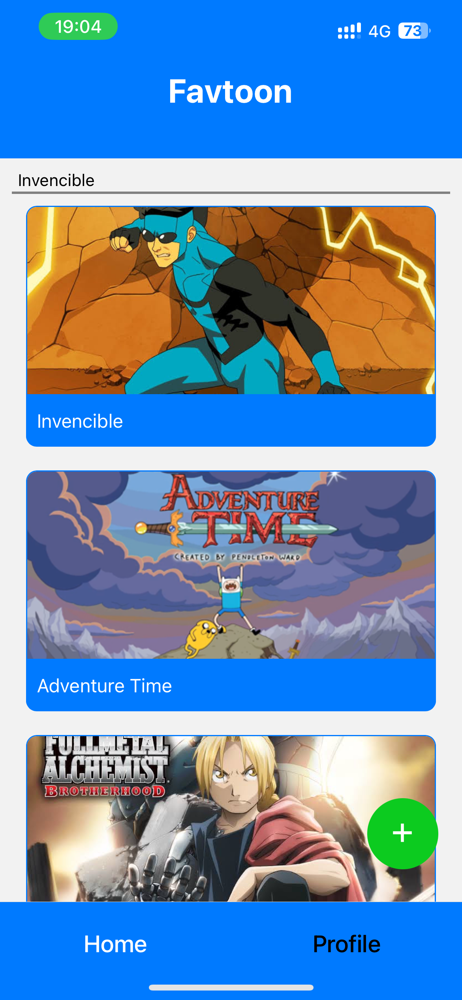
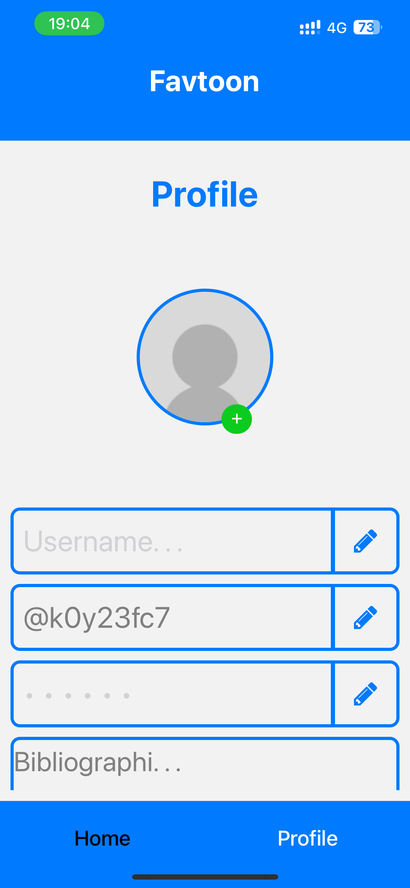
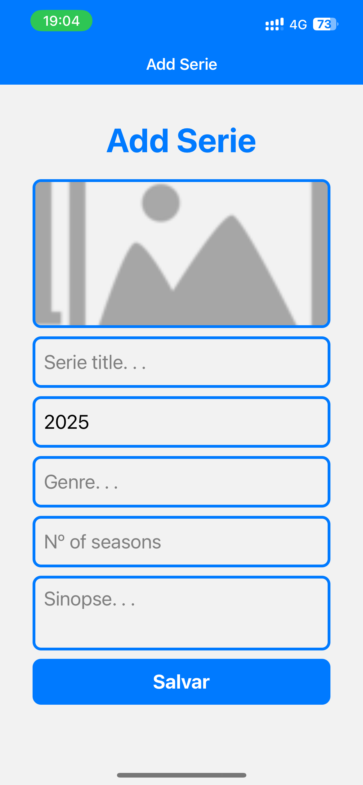
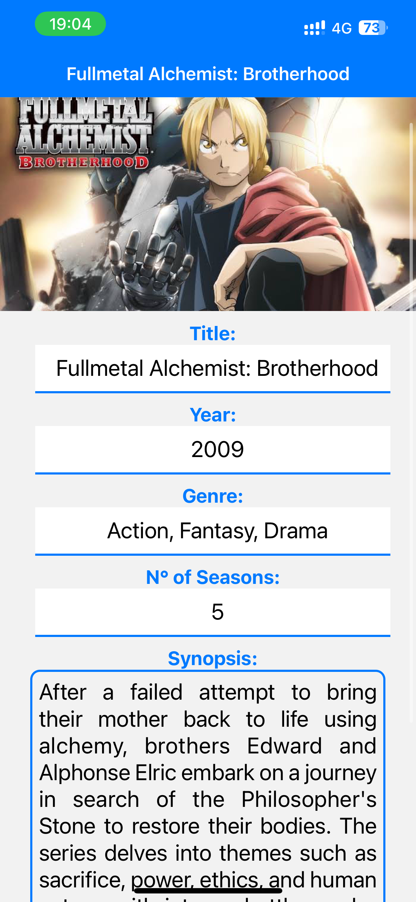

# Favtoon Mobile

Favtoon permite ao usuário adicionar suas series animadas favoritas como forma de listar as series ja assistidas.

# Funcionalidades

- [ x ] Criação de perfil de usuário;
- [ x ] Upload da imagem de perfil;
- [ x ] Adiçao de series animadas;
- [ x ] Adição de animes e desenhos ocidentais;
- [ x ] Upload da imagem da serie;
- [ x ] Listagem das series ja adicionadas;
- [ x ] Possibilidade de editar a serie adicionada;
- [ x ] Possibilidade de exclusão da serie;

# Print de Telas do aplicativo






# Comandos para o projeto funcionar

Para iniciar o `Favtoon Mobile` é preciso primeiro iniciar o JSON Server para assim gravar as alterações de Series no "Banco de Dados"

```terminal
json-server --watch data/db.json --port 3001
```

Após iniciar o JSON Server partimos para iniciar a aplicação via expo-router com:

```
yarn start --clear
```

ou

```
yarn android --clear
```
